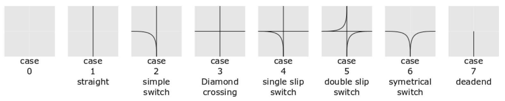

# SwitchFL: Switch-Centered Flatland Environment for Multi-Agent Reinforcement Learning

Welcome to **SwitchFL**, a custom **multi-agent reinforcement learning (MARL)** environment based on [Flatland](https://flatland.aicrowd.com/getting-started/env.html), designed with a novel **switch-centered** perspective. This environment shifts the focus of control from individual trains to **railway switches**, introducing unique coordination and planning challenges in a rail network.


## Table of Contents

- [Motivation](#motivation)
- [Environment Overview](#environment-overview)
- [Switch Types](#switch-types)
- [Installation](#installation)
- [Usage Example](#usage-example)
- [Observation Space](#observation-space)
- [Action Space](#action-space)
- [Rendering](#rendering)
- [Research & Use Cases](#research--use-cases)
- [Contributing](#contributing)
- [License](#license)


## Motivation

Traditional train-routing environments like Flatland focus on agent-centered control. **SwitchFL** introduces a novel abstraction by modeling **switches** as decision points. This perspective is better suited for **decentralized control**, **real-world railway signal systems**, and **asynchronous** agent interactions. 

It’s particularly useful for:
- Studying coordination across control points in transportation systems.
- Training RL agents in asynchronous, partially observable environments.
- Benchmarking switch-based vs. agent-based control.


## Environment Overview

**SwitchFL** is built on top of Flatland but wrapped in a **PettingZoo-compatible asynchronous multi-agent interface**.

### Key Features:
- **Asynchronous MARL environment**
- **Switch-centered control abstraction**
- Compatible with **PettingZoo (AEC)** interface
- Supports **Flatland and networkx rendering** 
- Includes **4 types of switches** with varying complexity as agent types


## Switch Types


SwitchFL includes the following switch types:

1. **T-Crossing**  
   Allows branching paths in a T shape (3-way split). This applies to case 2 and 6.

2. **Standard Crossing**  
   Classic railway cross with two intersecting paths (4-way cross). This applies to case 3.

3. **Single Turn Switch**  
   A switch with one 90° turn and two straight connections. This applies to case 4.

4. **Double Turn Switch**  
   A complex crossing with **two 90° turns**, offering multiple routing options. This applies to case 5.

Each switch is treated as an agent with its own observation and decision-making responsibility.


## Installation

we opted for poetry as the package-management system: 
```bash
git clone https://github.com/yourusername/switchfl.git
cd switchfl
poetry install
```

Ensure you have the following installed:

* `flatland-rl`
* `pettingzoo`
* `numpy`
* `pygame` (for rendering)
* `matplotlib` (optional, for visual debugging)


## Usage Example

```python
from flatland.envs.rail_env import RailEnv
from flatland.envs.rail_generators import sparse_rail_generator
from flatland.envs.line_generators import sparse_line_generator
from switchfl.switch_env import ASyncSwitchEnv

random_seed = 41
rail_env = RailEnv(
    width=18,
    height=18,
    rail_generator=sparse_rail_generator(
        max_num_cities=5,
        grid_mode=True,
        max_rails_between_cities=1,
        max_rail_pairs_in_city=1,
        seed=random_seed,
    ),
    line_generator=sparse_line_generator(seed=random_seed),
    number_of_agents=2,
)

env = ASyncSwitchEnv(rail_env, render_mode="human")

env.reset(seed=random_seed)
for agent in env.agent_iter():
    observation, reward, termination, truncation, info = env.last()
    
    if termination or truncation:
        break
    
    # Replace with your custom switch policy
    action = env.action_space(agent).sample(info["action_mask"])
    env.render()
    env.step(action)

env.close()
```

> ℹ️ Info
>
> Please note, that we deviate slightly from the petting zoo framework as we also return the id of the next switch the train will reach after a step. This is going to help for approaches in RL which use TD learning as we need here some kind of notation for the next state. Otherwise the decision making of a switch agent will turn to a Multi-Armed-Bandit (MAB). 


## Observation Space

Each agent (switch) receives a localized view of its surroundings:

* Switch state and occupancy
* Train proximity or scheduling info
* Track layout around the switch

The environment is equipped with a `Observer` scaffold. Therefor you can design your own observation space for a switch agent.  
As a default option we use the `StandardObserver` which can be found [here](switchfl/observer.py). This observer is discrete and includes:

- which outgoing ports are blocked by incoming trains
- where does an incoming would like to go
- how much delay does a train have

If there is no train to extract this knowledge from the corresponding spots in an observation are -1.  

## Action Space

Each switch decides which path to activate. The action space is:

* Discrete
* Action-masked (invalid options are masked out via `info["action_mask"]`)

Each discrete action corresponds to piping a train from one port to another if applicable. This results in different amount of available actions for an agent: 
1. **T-Crossing**: 4
2. **Standard Crossing**: 2
3. **Single Turn Switch**: 6    
4. **Double Turn Switch**: 8

For more details please refer to the [`switch definitions`](switchfl/switch_agents.py) or print `actions` of an `_Switch`    instance. 

## Rendering

SwitchFL supports human-friendly rendering via Flatland’s renderer:

```python
env = ASyncSwitchEnv(..., render_mode="human")
env.render()
```

Use this to visually debug the movement of trains and decisions made by switches.

## Implementation Details

SwitchFL transforms Flatland's train-centric approach into a **switch-centric multi-agent system** through several key components:

- **ASyncSwitchEnv**: Main environment controller that orchestrates train movement simulation, agent activation, and reward calculation
- **RailNetwork**: Manages railway topology, switch-to-switch connections, and train-switch interactions using graph representations
- **Switch Agents**: Individual controllers for different switch types (T-Crossing, Standard Crossing, Single/Double Turn) with unique action spaces
- **RailGraph**: Converts Flatland's grid-based environment into efficient graph structures for network analysis
- **Observer System**: Provides localized state observations including train proximity, port status, and network topology

The environment operates through an **asynchronous simulation loop** where trains move toward switches, switches become active agents when trains approach, and routing decisions are executed based on agent actions. This creates a distributed control system where coordination emerges through individual switch decisions.

For comprehensive implementation details, architecture diagrams, and technical challenges, please refer to the [detailed documentation](switchfl/README.md).


## Research & Use Cases

SwitchFL is a great platform for:

* Investigating coordination under partial observability.
* Benchmarking asynchronous vs. synchronous control paradigms.
* Studying traffic bottlenecks and switch prioritization strategies.
* Applying transformer-based policies or graph RL to transportation systems.


## Contributing

We welcome contributions! To contribute:

1. Fork this repository.
2. Create a new branch (`git checkout -b feature-foo`)
3. Commit your changes (`git commit -am 'Add feature foo'`)
4. Push to the branch (`git push origin feature-foo`)
5. Open a Pull Request.


## License

MIT License. See [LICENSE](./LICENSE) for details.


## Authors

If you use this code in your research, please cite:

```bibtex
@misc{uhrich2025gbidiff,
  title={SwitchFL: Switch-Centered Flatland Environment for Multi-Agent Reinforcement Learning},
  author={Uhrich, Robin and Mussi, Marco and Restelli, Marcello},
  year={2025},
  url={https://github.com/RobinU434/SwitchFL}
}
```

## Related Projects

* [Flatland](https://flatland.aicrowd.com/getting-started/env.html)
* [PettingZoo](https://pettingzoo.farama.org/)
        